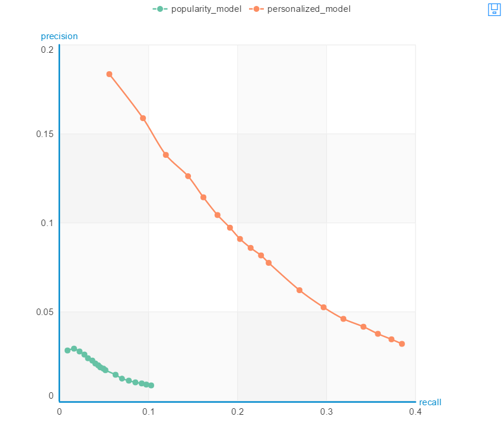

```python
import graphlab
```

# Load music data


```python
song_data = graphlab.SFrame('song_data.gl/')
```    

# Explore Data


```python
song_data.head()
```


<div style="max-height:1000px;max-width:1500px;overflow:auto;"><table frame="box" rules="cols">
    <tr>
        <th style="padding-left: 1em; padding-right: 1em; text-align: center">user_id</th>
        <th style="padding-left: 1em; padding-right: 1em; text-align: center">song_id</th>
        <th style="padding-left: 1em; padding-right: 1em; text-align: center">listen_count</th>
        <th style="padding-left: 1em; padding-right: 1em; text-align: center">title</th>
        <th style="padding-left: 1em; padding-right: 1em; text-align: center">artist</th>
    </tr>
    <tr>
        <td style="padding-left: 1em; padding-right: 1em; text-align: center; vertical-align: top">b80344d063b5ccb3212f76538<br>f3d9e43d87dca9e ...</td>
        <td style="padding-left: 1em; padding-right: 1em; text-align: center; vertical-align: top">SOAKIMP12A8C130995</td>
        <td style="padding-left: 1em; padding-right: 1em; text-align: center; vertical-align: top">1</td>
        <td style="padding-left: 1em; padding-right: 1em; text-align: center; vertical-align: top">The Cove</td>
        <td style="padding-left: 1em; padding-right: 1em; text-align: center; vertical-align: top">Jack Johnson</td>
    </tr>
    <tr>
        <td style="padding-left: 1em; padding-right: 1em; text-align: center; vertical-align: top">b80344d063b5ccb3212f76538<br>f3d9e43d87dca9e ...</td>
        <td style="padding-left: 1em; padding-right: 1em; text-align: center; vertical-align: top">SOBBMDR12A8C13253B</td>
        <td style="padding-left: 1em; padding-right: 1em; text-align: center; vertical-align: top">2</td>
        <td style="padding-left: 1em; padding-right: 1em; text-align: center; vertical-align: top">Entre Dos Aguas</td>
        <td style="padding-left: 1em; padding-right: 1em; text-align: center; vertical-align: top">Paco De Lucia</td>
    </tr>
    <tr>
        <td style="padding-left: 1em; padding-right: 1em; text-align: center; vertical-align: top">b80344d063b5ccb3212f76538<br>f3d9e43d87dca9e ...</td>
        <td style="padding-left: 1em; padding-right: 1em; text-align: center; vertical-align: top">SOBXHDL12A81C204C0</td>
        <td style="padding-left: 1em; padding-right: 1em; text-align: center; vertical-align: top">1</td>
        <td style="padding-left: 1em; padding-right: 1em; text-align: center; vertical-align: top">Stronger</td>
        <td style="padding-left: 1em; padding-right: 1em; text-align: center; vertical-align: top">Kanye West</td>
    </tr>
    <tr>
        <td style="padding-left: 1em; padding-right: 1em; text-align: center; vertical-align: top">b80344d063b5ccb3212f76538<br>f3d9e43d87dca9e ...</td>
        <td style="padding-left: 1em; padding-right: 1em; text-align: center; vertical-align: top">SOBYHAJ12A6701BF1D</td>
        <td style="padding-left: 1em; padding-right: 1em; text-align: center; vertical-align: top">1</td>
        <td style="padding-left: 1em; padding-right: 1em; text-align: center; vertical-align: top">Constellations</td>
        <td style="padding-left: 1em; padding-right: 1em; text-align: center; vertical-align: top">Jack Johnson</td>
    </tr>
    <tr>
        <td style="padding-left: 1em; padding-right: 1em; text-align: center; vertical-align: top">b80344d063b5ccb3212f76538<br>f3d9e43d87dca9e ...</td>
        <td style="padding-left: 1em; padding-right: 1em; text-align: center; vertical-align: top">SODACBL12A8C13C273</td>
        <td style="padding-left: 1em; padding-right: 1em; text-align: center; vertical-align: top">1</td>
        <td style="padding-left: 1em; padding-right: 1em; text-align: center; vertical-align: top">Learn To Fly</td>
        <td style="padding-left: 1em; padding-right: 1em; text-align: center; vertical-align: top">Foo Fighters</td>
    </tr>
    <tr>
        <td style="padding-left: 1em; padding-right: 1em; text-align: center; vertical-align: top">b80344d063b5ccb3212f76538<br>f3d9e43d87dca9e ...</td>
        <td style="padding-left: 1em; padding-right: 1em; text-align: center; vertical-align: top">SODDNQT12A6D4F5F7E</td>
        <td style="padding-left: 1em; padding-right: 1em; text-align: center; vertical-align: top">5</td>
        <td style="padding-left: 1em; padding-right: 1em; text-align: center; vertical-align: top">Apuesta Por El Rock 'N'<br>Roll ...</td>
        <td style="padding-left: 1em; padding-right: 1em; text-align: center; vertical-align: top">Héroes del Silencio</td>
    </tr>
    <tr>
        <td style="padding-left: 1em; padding-right: 1em; text-align: center; vertical-align: top">b80344d063b5ccb3212f76538<br>f3d9e43d87dca9e ...</td>
        <td style="padding-left: 1em; padding-right: 1em; text-align: center; vertical-align: top">SODXRTY12AB0180F3B</td>
        <td style="padding-left: 1em; padding-right: 1em; text-align: center; vertical-align: top">1</td>
        <td style="padding-left: 1em; padding-right: 1em; text-align: center; vertical-align: top">Paper Gangsta</td>
        <td style="padding-left: 1em; padding-right: 1em; text-align: center; vertical-align: top">Lady GaGa</td>
    </tr>
    <tr>
        <td style="padding-left: 1em; padding-right: 1em; text-align: center; vertical-align: top">b80344d063b5ccb3212f76538<br>f3d9e43d87dca9e ...</td>
        <td style="padding-left: 1em; padding-right: 1em; text-align: center; vertical-align: top">SOFGUAY12AB017B0A8</td>
        <td style="padding-left: 1em; padding-right: 1em; text-align: center; vertical-align: top">1</td>
        <td style="padding-left: 1em; padding-right: 1em; text-align: center; vertical-align: top">Stacked Actors</td>
        <td style="padding-left: 1em; padding-right: 1em; text-align: center; vertical-align: top">Foo Fighters</td>
    </tr>
    <tr>
        <td style="padding-left: 1em; padding-right: 1em; text-align: center; vertical-align: top">b80344d063b5ccb3212f76538<br>f3d9e43d87dca9e ...</td>
        <td style="padding-left: 1em; padding-right: 1em; text-align: center; vertical-align: top">SOFRQTD12A81C233C0</td>
        <td style="padding-left: 1em; padding-right: 1em; text-align: center; vertical-align: top">1</td>
        <td style="padding-left: 1em; padding-right: 1em; text-align: center; vertical-align: top">Sehr kosmisch</td>
        <td style="padding-left: 1em; padding-right: 1em; text-align: center; vertical-align: top">Harmonia</td>
    </tr>
    <tr>
        <td style="padding-left: 1em; padding-right: 1em; text-align: center; vertical-align: top">b80344d063b5ccb3212f76538<br>f3d9e43d87dca9e ...</td>
        <td style="padding-left: 1em; padding-right: 1em; text-align: center; vertical-align: top">SOHQWYZ12A6D4FA701</td>
        <td style="padding-left: 1em; padding-right: 1em; text-align: center; vertical-align: top">1</td>
        <td style="padding-left: 1em; padding-right: 1em; text-align: center; vertical-align: top">Heaven's gonna burn your<br>eyes ...</td>
        <td style="padding-left: 1em; padding-right: 1em; text-align: center; vertical-align: top">Thievery Corporation<br>feat. Emiliana Torrini ...</td>
    </tr>
</table>
<table frame="box" rules="cols">
    <tr>
        <th style="padding-left: 1em; padding-right: 1em; text-align: center">song</th>
    </tr>
    <tr>
        <td style="padding-left: 1em; padding-right: 1em; text-align: center; vertical-align: top">The Cove - Jack Johnson</td>
    </tr>
    <tr>
        <td style="padding-left: 1em; padding-right: 1em; text-align: center; vertical-align: top">Entre Dos Aguas - Paco De<br>Lucia ...</td>
    </tr>
    <tr>
        <td style="padding-left: 1em; padding-right: 1em; text-align: center; vertical-align: top">Stronger - Kanye West</td>
    </tr>
    <tr>
        <td style="padding-left: 1em; padding-right: 1em; text-align: center; vertical-align: top">Constellations - Jack<br>Johnson ...</td>
    </tr>
    <tr>
        <td style="padding-left: 1em; padding-right: 1em; text-align: center; vertical-align: top">Learn To Fly - Foo<br>Fighters ...</td>
    </tr>
    <tr>
        <td style="padding-left: 1em; padding-right: 1em; text-align: center; vertical-align: top">Apuesta Por El Rock 'N'<br>Roll - Héroes del ...</td>
    </tr>
    <tr>
        <td style="padding-left: 1em; padding-right: 1em; text-align: center; vertical-align: top">Paper Gangsta - Lady GaGa</td>
    </tr>
    <tr>
        <td style="padding-left: 1em; padding-right: 1em; text-align: center; vertical-align: top">Stacked Actors - Foo<br>Fighters ...</td>
    </tr>
    <tr>
        <td style="padding-left: 1em; padding-right: 1em; text-align: center; vertical-align: top">Sehr kosmisch - Harmonia</td>
    </tr>
    <tr>
        <td style="padding-left: 1em; padding-right: 1em; text-align: center; vertical-align: top">Heaven's gonna burn your<br>eyes - Thievery ...</td>
    </tr>
</table>
[10 rows x 6 columns]<br/>
</div>


## Showing the most popular songs in the dataset


```python
graphlab.canvas.set_target('ipynb')
```


```python
song_data['song'].show()
```


```python
len(song_data)
```


    1116609


## Count number of users


```python
users = song_data['user_id'].unique()
```


```python
len(users)
```


    66346


# Create a song recommender


```python
train_data,test_data = song_data.random_split(.8,seed=0)
```

## Simple popularity-based recommender


```python
popularity_model = graphlab.popularity_recommender.create(train_data,
                                                         user_id = 'user_id',
                                                         item_id = 'song')
```


<pre>Recsys training: model = popularity</pre>


<pre>Warning: Ignoring columns song_id, listen_count, title, artist;</pre>


<pre>    To use one of these as a target column, set target = <column_name></pre>


<pre>    and use a method that allows the use of a target.</pre>


<pre>Preparing data set.</pre>


<pre>    Data has 893580 observations with 66085 users and 9952 items.</pre>


<pre>    Data prepared in: 1.01104s</pre>


<pre>893580 observations to process; with 9952 unique items.</pre>


### Use the popularity model to make some predictions


```python
popularity_model.recommend(users=[users[0]])
```


<div style="max-height:1000px;max-width:1500px;overflow:auto;"><table frame="box" rules="cols">
    <tr>
        <th style="padding-left: 1em; padding-right: 1em; text-align: center">user_id</th>
        <th style="padding-left: 1em; padding-right: 1em; text-align: center">song</th>
        <th style="padding-left: 1em; padding-right: 1em; text-align: center">score</th>
        <th style="padding-left: 1em; padding-right: 1em; text-align: center">rank</th>
    </tr>
    <tr>
        <td style="padding-left: 1em; padding-right: 1em; text-align: center; vertical-align: top">c66c10a9567f0d82ff31441a9<br>fd5063e5cd9dfe8 ...</td>
        <td style="padding-left: 1em; padding-right: 1em; text-align: center; vertical-align: top">Sehr kosmisch - Harmonia</td>
        <td style="padding-left: 1em; padding-right: 1em; text-align: center; vertical-align: top">4754.0</td>
        <td style="padding-left: 1em; padding-right: 1em; text-align: center; vertical-align: top">1</td>
    </tr>
    <tr>
        <td style="padding-left: 1em; padding-right: 1em; text-align: center; vertical-align: top">c66c10a9567f0d82ff31441a9<br>fd5063e5cd9dfe8 ...</td>
        <td style="padding-left: 1em; padding-right: 1em; text-align: center; vertical-align: top">Undo - Björk</td>
        <td style="padding-left: 1em; padding-right: 1em; text-align: center; vertical-align: top">4227.0</td>
        <td style="padding-left: 1em; padding-right: 1em; text-align: center; vertical-align: top">2</td>
    </tr>
    <tr>
        <td style="padding-left: 1em; padding-right: 1em; text-align: center; vertical-align: top">c66c10a9567f0d82ff31441a9<br>fd5063e5cd9dfe8 ...</td>
        <td style="padding-left: 1em; padding-right: 1em; text-align: center; vertical-align: top">You're The One - Dwight<br>Yoakam ...</td>
        <td style="padding-left: 1em; padding-right: 1em; text-align: center; vertical-align: top">3781.0</td>
        <td style="padding-left: 1em; padding-right: 1em; text-align: center; vertical-align: top">3</td>
    </tr>
    <tr>
        <td style="padding-left: 1em; padding-right: 1em; text-align: center; vertical-align: top">c66c10a9567f0d82ff31441a9<br>fd5063e5cd9dfe8 ...</td>
        <td style="padding-left: 1em; padding-right: 1em; text-align: center; vertical-align: top">Dog Days Are Over (Radio<br>Edit) - Florence + The ...</td>
        <td style="padding-left: 1em; padding-right: 1em; text-align: center; vertical-align: top">3633.0</td>
        <td style="padding-left: 1em; padding-right: 1em; text-align: center; vertical-align: top">4</td>
    </tr>
    <tr>
        <td style="padding-left: 1em; padding-right: 1em; text-align: center; vertical-align: top">c66c10a9567f0d82ff31441a9<br>fd5063e5cd9dfe8 ...</td>
        <td style="padding-left: 1em; padding-right: 1em; text-align: center; vertical-align: top">Revelry - Kings Of Leon</td>
        <td style="padding-left: 1em; padding-right: 1em; text-align: center; vertical-align: top">3527.0</td>
        <td style="padding-left: 1em; padding-right: 1em; text-align: center; vertical-align: top">5</td>
    </tr>
    <tr>
        <td style="padding-left: 1em; padding-right: 1em; text-align: center; vertical-align: top">c66c10a9567f0d82ff31441a9<br>fd5063e5cd9dfe8 ...</td>
        <td style="padding-left: 1em; padding-right: 1em; text-align: center; vertical-align: top">Horn Concerto No. 4 in E<br>flat K495: II. Romance ...</td>
        <td style="padding-left: 1em; padding-right: 1em; text-align: center; vertical-align: top">3161.0</td>
        <td style="padding-left: 1em; padding-right: 1em; text-align: center; vertical-align: top">6</td>
    </tr>
    <tr>
        <td style="padding-left: 1em; padding-right: 1em; text-align: center; vertical-align: top">c66c10a9567f0d82ff31441a9<br>fd5063e5cd9dfe8 ...</td>
        <td style="padding-left: 1em; padding-right: 1em; text-align: center; vertical-align: top">Secrets - OneRepublic</td>
        <td style="padding-left: 1em; padding-right: 1em; text-align: center; vertical-align: top">3148.0</td>
        <td style="padding-left: 1em; padding-right: 1em; text-align: center; vertical-align: top">7</td>
    </tr>
    <tr>
        <td style="padding-left: 1em; padding-right: 1em; text-align: center; vertical-align: top">c66c10a9567f0d82ff31441a9<br>fd5063e5cd9dfe8 ...</td>
        <td style="padding-left: 1em; padding-right: 1em; text-align: center; vertical-align: top">Fireflies - Charttraxx<br>Karaoke ...</td>
        <td style="padding-left: 1em; padding-right: 1em; text-align: center; vertical-align: top">2532.0</td>
        <td style="padding-left: 1em; padding-right: 1em; text-align: center; vertical-align: top">8</td>
    </tr>
    <tr>
        <td style="padding-left: 1em; padding-right: 1em; text-align: center; vertical-align: top">c66c10a9567f0d82ff31441a9<br>fd5063e5cd9dfe8 ...</td>
        <td style="padding-left: 1em; padding-right: 1em; text-align: center; vertical-align: top">Tive Sim - Cartola</td>
        <td style="padding-left: 1em; padding-right: 1em; text-align: center; vertical-align: top">2521.0</td>
        <td style="padding-left: 1em; padding-right: 1em; text-align: center; vertical-align: top">9</td>
    </tr>
    <tr>
        <td style="padding-left: 1em; padding-right: 1em; text-align: center; vertical-align: top">c66c10a9567f0d82ff31441a9<br>fd5063e5cd9dfe8 ...</td>
        <td style="padding-left: 1em; padding-right: 1em; text-align: center; vertical-align: top">Drop The World - Lil<br>Wayne / Eminem ...</td>
        <td style="padding-left: 1em; padding-right: 1em; text-align: center; vertical-align: top">2053.0</td>
        <td style="padding-left: 1em; padding-right: 1em; text-align: center; vertical-align: top">10</td>
    </tr>
</table>
[10 rows x 4 columns]<br/>
</div>


```python
popularity_model.recommend(users=[users[1]])
```


<div style="max-height:1000px;max-width:1500px;overflow:auto;"><table frame="box" rules="cols">
    <tr>
        <th style="padding-left: 1em; padding-right: 1em; text-align: center">user_id</th>
        <th style="padding-left: 1em; padding-right: 1em; text-align: center">song</th>
        <th style="padding-left: 1em; padding-right: 1em; text-align: center">score</th>
        <th style="padding-left: 1em; padding-right: 1em; text-align: center">rank</th>
    </tr>
    <tr>
        <td style="padding-left: 1em; padding-right: 1em; text-align: center; vertical-align: top">279292bb36dbfc7f505e36ebf<br>038c81eb1d1d63e ...</td>
        <td style="padding-left: 1em; padding-right: 1em; text-align: center; vertical-align: top">Sehr kosmisch - Harmonia</td>
        <td style="padding-left: 1em; padding-right: 1em; text-align: center; vertical-align: top">4754.0</td>
        <td style="padding-left: 1em; padding-right: 1em; text-align: center; vertical-align: top">1</td>
    </tr>
    <tr>
        <td style="padding-left: 1em; padding-right: 1em; text-align: center; vertical-align: top">279292bb36dbfc7f505e36ebf<br>038c81eb1d1d63e ...</td>
        <td style="padding-left: 1em; padding-right: 1em; text-align: center; vertical-align: top">Undo - Björk</td>
        <td style="padding-left: 1em; padding-right: 1em; text-align: center; vertical-align: top">4227.0</td>
        <td style="padding-left: 1em; padding-right: 1em; text-align: center; vertical-align: top">2</td>
    </tr>
    <tr>
        <td style="padding-left: 1em; padding-right: 1em; text-align: center; vertical-align: top">279292bb36dbfc7f505e36ebf<br>038c81eb1d1d63e ...</td>
        <td style="padding-left: 1em; padding-right: 1em; text-align: center; vertical-align: top">You're The One - Dwight<br>Yoakam ...</td>
        <td style="padding-left: 1em; padding-right: 1em; text-align: center; vertical-align: top">3781.0</td>
        <td style="padding-left: 1em; padding-right: 1em; text-align: center; vertical-align: top">3</td>
    </tr>
    <tr>
        <td style="padding-left: 1em; padding-right: 1em; text-align: center; vertical-align: top">279292bb36dbfc7f505e36ebf<br>038c81eb1d1d63e ...</td>
        <td style="padding-left: 1em; padding-right: 1em; text-align: center; vertical-align: top">Dog Days Are Over (Radio<br>Edit) - Florence + The ...</td>
        <td style="padding-left: 1em; padding-right: 1em; text-align: center; vertical-align: top">3633.0</td>
        <td style="padding-left: 1em; padding-right: 1em; text-align: center; vertical-align: top">4</td>
    </tr>
    <tr>
        <td style="padding-left: 1em; padding-right: 1em; text-align: center; vertical-align: top">279292bb36dbfc7f505e36ebf<br>038c81eb1d1d63e ...</td>
        <td style="padding-left: 1em; padding-right: 1em; text-align: center; vertical-align: top">Revelry - Kings Of Leon</td>
        <td style="padding-left: 1em; padding-right: 1em; text-align: center; vertical-align: top">3527.0</td>
        <td style="padding-left: 1em; padding-right: 1em; text-align: center; vertical-align: top">5</td>
    </tr>
    <tr>
        <td style="padding-left: 1em; padding-right: 1em; text-align: center; vertical-align: top">279292bb36dbfc7f505e36ebf<br>038c81eb1d1d63e ...</td>
        <td style="padding-left: 1em; padding-right: 1em; text-align: center; vertical-align: top">Horn Concerto No. 4 in E<br>flat K495: II. Romance ...</td>
        <td style="padding-left: 1em; padding-right: 1em; text-align: center; vertical-align: top">3161.0</td>
        <td style="padding-left: 1em; padding-right: 1em; text-align: center; vertical-align: top">6</td>
    </tr>
    <tr>
        <td style="padding-left: 1em; padding-right: 1em; text-align: center; vertical-align: top">279292bb36dbfc7f505e36ebf<br>038c81eb1d1d63e ...</td>
        <td style="padding-left: 1em; padding-right: 1em; text-align: center; vertical-align: top">Secrets - OneRepublic</td>
        <td style="padding-left: 1em; padding-right: 1em; text-align: center; vertical-align: top">3148.0</td>
        <td style="padding-left: 1em; padding-right: 1em; text-align: center; vertical-align: top">7</td>
    </tr>
    <tr>
        <td style="padding-left: 1em; padding-right: 1em; text-align: center; vertical-align: top">279292bb36dbfc7f505e36ebf<br>038c81eb1d1d63e ...</td>
        <td style="padding-left: 1em; padding-right: 1em; text-align: center; vertical-align: top">Hey_ Soul Sister - Train</td>
        <td style="padding-left: 1em; padding-right: 1em; text-align: center; vertical-align: top">2538.0</td>
        <td style="padding-left: 1em; padding-right: 1em; text-align: center; vertical-align: top">8</td>
    </tr>
    <tr>
        <td style="padding-left: 1em; padding-right: 1em; text-align: center; vertical-align: top">279292bb36dbfc7f505e36ebf<br>038c81eb1d1d63e ...</td>
        <td style="padding-left: 1em; padding-right: 1em; text-align: center; vertical-align: top">Fireflies - Charttraxx<br>Karaoke ...</td>
        <td style="padding-left: 1em; padding-right: 1em; text-align: center; vertical-align: top">2532.0</td>
        <td style="padding-left: 1em; padding-right: 1em; text-align: center; vertical-align: top">9</td>
    </tr>
    <tr>
        <td style="padding-left: 1em; padding-right: 1em; text-align: center; vertical-align: top">279292bb36dbfc7f505e36ebf<br>038c81eb1d1d63e ...</td>
        <td style="padding-left: 1em; padding-right: 1em; text-align: center; vertical-align: top">Tive Sim - Cartola</td>
        <td style="padding-left: 1em; padding-right: 1em; text-align: center; vertical-align: top">2521.0</td>
        <td style="padding-left: 1em; padding-right: 1em; text-align: center; vertical-align: top">10</td>
    </tr>
</table>
[10 rows x 4 columns]<br/>
</div>


#### NOTE: Everyone gets same recommendation list

## Build a song recommender with personalization


```python
personalized_model = graphlab.item_similarity_recommender.create(train_data,
                                                                user_id = 'user_id',
                                                                item_id = 'song')
```


<pre>Recsys training: model = item_similarity</pre>


<pre>Warning: Ignoring columns song_id, listen_count, title, artist;</pre>


<pre>    To use one of these as a target column, set target = <column_name></pre>


<pre>    and use a method that allows the use of a target.</pre>


<pre>Preparing data set.</pre>


<pre>    Data has 893580 observations with 66085 users and 9952 items.</pre>


<pre>    Data prepared in: 0.859782s</pre>


<pre>Training model from provided data.</pre>


<pre>Gathering per-item and per-user statistics.</pre>


<pre>+--------------------------------+------------+</pre>


<pre>| Elapsed Time (Item Statistics) | % Complete |</pre>


<pre>+--------------------------------+------------+</pre>


<pre>| 26.063ms                       | 1.5        |</pre>


<pre>| 55.14ms                        | 100        |</pre>


<pre>+--------------------------------+------------+</pre>


<pre>Setting up lookup tables.</pre>


<pre>Processing data in one pass using dense lookup tables.</pre>


<pre>+-------------------------------------+------------------+-----------------+</pre>


<pre>| Elapsed Time (Constructing Lookups) | Total % Complete | Items Processed |</pre>


<pre>+-------------------------------------+------------------+-----------------+</pre>


<pre>| 222.591ms                           | 0                | 0               |</pre>


<pre>| 2.00s                               | 100              | 9952            |</pre>


<pre>+-------------------------------------+------------------+-----------------+</pre>


<pre>Finalizing lookup tables.</pre>


<pre>Generating candidate set for working with new users.</pre>


<pre>Finished training in 3.07085s</pre>


### Applying the personalized model to make song recommendations


```python
personalized_model.recommend(users=[users[0]])
```


<div style="max-height:1000px;max-width:1500px;overflow:auto;"><table frame="box" rules="cols">
    <tr>
        <th style="padding-left: 1em; padding-right: 1em; text-align: center">user_id</th>
        <th style="padding-left: 1em; padding-right: 1em; text-align: center">song</th>
        <th style="padding-left: 1em; padding-right: 1em; text-align: center">score</th>
        <th style="padding-left: 1em; padding-right: 1em; text-align: center">rank</th>
    </tr>
    <tr>
        <td style="padding-left: 1em; padding-right: 1em; text-align: center; vertical-align: top">c66c10a9567f0d82ff31441a9<br>fd5063e5cd9dfe8 ...</td>
        <td style="padding-left: 1em; padding-right: 1em; text-align: center; vertical-align: top">Cuando Pase El Temblor -<br>Soda Stereo ...</td>
        <td style="padding-left: 1em; padding-right: 1em; text-align: center; vertical-align: top">0.0194504536115</td>
        <td style="padding-left: 1em; padding-right: 1em; text-align: center; vertical-align: top">1</td>
    </tr>
    <tr>
        <td style="padding-left: 1em; padding-right: 1em; text-align: center; vertical-align: top">c66c10a9567f0d82ff31441a9<br>fd5063e5cd9dfe8 ...</td>
        <td style="padding-left: 1em; padding-right: 1em; text-align: center; vertical-align: top">Fireflies - Charttraxx<br>Karaoke ...</td>
        <td style="padding-left: 1em; padding-right: 1em; text-align: center; vertical-align: top">0.0144737317012</td>
        <td style="padding-left: 1em; padding-right: 1em; text-align: center; vertical-align: top">2</td>
    </tr>
    <tr>
        <td style="padding-left: 1em; padding-right: 1em; text-align: center; vertical-align: top">c66c10a9567f0d82ff31441a9<br>fd5063e5cd9dfe8 ...</td>
        <td style="padding-left: 1em; padding-right: 1em; text-align: center; vertical-align: top">Love Is A Losing Game -<br>Amy Winehouse ...</td>
        <td style="padding-left: 1em; padding-right: 1em; text-align: center; vertical-align: top">0.0142865960415</td>
        <td style="padding-left: 1em; padding-right: 1em; text-align: center; vertical-align: top">3</td>
    </tr>
    <tr>
        <td style="padding-left: 1em; padding-right: 1em; text-align: center; vertical-align: top">c66c10a9567f0d82ff31441a9<br>fd5063e5cd9dfe8 ...</td>
        <td style="padding-left: 1em; padding-right: 1em; text-align: center; vertical-align: top">Marry Me - Train</td>
        <td style="padding-left: 1em; padding-right: 1em; text-align: center; vertical-align: top">0.014133471709</td>
        <td style="padding-left: 1em; padding-right: 1em; text-align: center; vertical-align: top">4</td>
    </tr>
    <tr>
        <td style="padding-left: 1em; padding-right: 1em; text-align: center; vertical-align: top">c66c10a9567f0d82ff31441a9<br>fd5063e5cd9dfe8 ...</td>
        <td style="padding-left: 1em; padding-right: 1em; text-align: center; vertical-align: top">Secrets - OneRepublic</td>
        <td style="padding-left: 1em; padding-right: 1em; text-align: center; vertical-align: top">0.013591665488</td>
        <td style="padding-left: 1em; padding-right: 1em; text-align: center; vertical-align: top">5</td>
    </tr>
    <tr>
        <td style="padding-left: 1em; padding-right: 1em; text-align: center; vertical-align: top">c66c10a9567f0d82ff31441a9<br>fd5063e5cd9dfe8 ...</td>
        <td style="padding-left: 1em; padding-right: 1em; text-align: center; vertical-align: top">Sehr kosmisch - Harmonia</td>
        <td style="padding-left: 1em; padding-right: 1em; text-align: center; vertical-align: top">0.0133987894425</td>
        <td style="padding-left: 1em; padding-right: 1em; text-align: center; vertical-align: top">6</td>
    </tr>
    <tr>
        <td style="padding-left: 1em; padding-right: 1em; text-align: center; vertical-align: top">c66c10a9567f0d82ff31441a9<br>fd5063e5cd9dfe8 ...</td>
        <td style="padding-left: 1em; padding-right: 1em; text-align: center; vertical-align: top">Te Hacen Falta Vitaminas<br>- Soda Stereo ...</td>
        <td style="padding-left: 1em; padding-right: 1em; text-align: center; vertical-align: top">0.0129302831796</td>
        <td style="padding-left: 1em; padding-right: 1em; text-align: center; vertical-align: top">7</td>
    </tr>
    <tr>
        <td style="padding-left: 1em; padding-right: 1em; text-align: center; vertical-align: top">c66c10a9567f0d82ff31441a9<br>fd5063e5cd9dfe8 ...</td>
        <td style="padding-left: 1em; padding-right: 1em; text-align: center; vertical-align: top">OMG - Usher featuring<br>will.i.am ...</td>
        <td style="padding-left: 1em; padding-right: 1em; text-align: center; vertical-align: top">0.0127778282532</td>
        <td style="padding-left: 1em; padding-right: 1em; text-align: center; vertical-align: top">8</td>
    </tr>
    <tr>
        <td style="padding-left: 1em; padding-right: 1em; text-align: center; vertical-align: top">c66c10a9567f0d82ff31441a9<br>fd5063e5cd9dfe8 ...</td>
        <td style="padding-left: 1em; padding-right: 1em; text-align: center; vertical-align: top">Y solo se me ocurre<br>amarte (Unplugged) - ...</td>
        <td style="padding-left: 1em; padding-right: 1em; text-align: center; vertical-align: top">0.0123411279458</td>
        <td style="padding-left: 1em; padding-right: 1em; text-align: center; vertical-align: top">9</td>
    </tr>
    <tr>
        <td style="padding-left: 1em; padding-right: 1em; text-align: center; vertical-align: top">c66c10a9567f0d82ff31441a9<br>fd5063e5cd9dfe8 ...</td>
        <td style="padding-left: 1em; padding-right: 1em; text-align: center; vertical-align: top">No Dejes Que... -<br>Caifanes ...</td>
        <td style="padding-left: 1em; padding-right: 1em; text-align: center; vertical-align: top">0.0121042499175</td>
        <td style="padding-left: 1em; padding-right: 1em; text-align: center; vertical-align: top">10</td>
    </tr>
</table>
[10 rows x 4 columns]<br/>
</div>


```python
personalized_model.recommend(users=[users[1]])
```


<div style="max-height:1000px;max-width:1500px;overflow:auto;"><table frame="box" rules="cols">
    <tr>
        <th style="padding-left: 1em; padding-right: 1em; text-align: center">user_id</th>
        <th style="padding-left: 1em; padding-right: 1em; text-align: center">song</th>
        <th style="padding-left: 1em; padding-right: 1em; text-align: center">score</th>
        <th style="padding-left: 1em; padding-right: 1em; text-align: center">rank</th>
    </tr>
    <tr>
        <td style="padding-left: 1em; padding-right: 1em; text-align: center; vertical-align: top">279292bb36dbfc7f505e36ebf<br>038c81eb1d1d63e ...</td>
        <td style="padding-left: 1em; padding-right: 1em; text-align: center; vertical-align: top">Riot In Cell Block Number<br>Nine - Dr Feelgood ...</td>
        <td style="padding-left: 1em; padding-right: 1em; text-align: center; vertical-align: top">0.0374999940395</td>
        <td style="padding-left: 1em; padding-right: 1em; text-align: center; vertical-align: top">1</td>
    </tr>
    <tr>
        <td style="padding-left: 1em; padding-right: 1em; text-align: center; vertical-align: top">279292bb36dbfc7f505e36ebf<br>038c81eb1d1d63e ...</td>
        <td style="padding-left: 1em; padding-right: 1em; text-align: center; vertical-align: top">Sei Lá Mangueira -<br>Elizeth Cardoso ...</td>
        <td style="padding-left: 1em; padding-right: 1em; text-align: center; vertical-align: top">0.0331632643938</td>
        <td style="padding-left: 1em; padding-right: 1em; text-align: center; vertical-align: top">2</td>
    </tr>
    <tr>
        <td style="padding-left: 1em; padding-right: 1em; text-align: center; vertical-align: top">279292bb36dbfc7f505e36ebf<br>038c81eb1d1d63e ...</td>
        <td style="padding-left: 1em; padding-right: 1em; text-align: center; vertical-align: top">The Stallion - Ween</td>
        <td style="padding-left: 1em; padding-right: 1em; text-align: center; vertical-align: top">0.0322580635548</td>
        <td style="padding-left: 1em; padding-right: 1em; text-align: center; vertical-align: top">3</td>
    </tr>
    <tr>
        <td style="padding-left: 1em; padding-right: 1em; text-align: center; vertical-align: top">279292bb36dbfc7f505e36ebf<br>038c81eb1d1d63e ...</td>
        <td style="padding-left: 1em; padding-right: 1em; text-align: center; vertical-align: top">Rain - Subhumans</td>
        <td style="padding-left: 1em; padding-right: 1em; text-align: center; vertical-align: top">0.0314159244299</td>
        <td style="padding-left: 1em; padding-right: 1em; text-align: center; vertical-align: top">4</td>
    </tr>
    <tr>
        <td style="padding-left: 1em; padding-right: 1em; text-align: center; vertical-align: top">279292bb36dbfc7f505e36ebf<br>038c81eb1d1d63e ...</td>
        <td style="padding-left: 1em; padding-right: 1em; text-align: center; vertical-align: top">West One (Shine On Me) -<br>The Ruts ...</td>
        <td style="padding-left: 1em; padding-right: 1em; text-align: center; vertical-align: top">0.0306771993637</td>
        <td style="padding-left: 1em; padding-right: 1em; text-align: center; vertical-align: top">5</td>
    </tr>
    <tr>
        <td style="padding-left: 1em; padding-right: 1em; text-align: center; vertical-align: top">279292bb36dbfc7f505e36ebf<br>038c81eb1d1d63e ...</td>
        <td style="padding-left: 1em; padding-right: 1em; text-align: center; vertical-align: top">Back Against The Wall -<br>Cage The Elephant ...</td>
        <td style="padding-left: 1em; padding-right: 1em; text-align: center; vertical-align: top">0.0301204770803</td>
        <td style="padding-left: 1em; padding-right: 1em; text-align: center; vertical-align: top">6</td>
    </tr>
    <tr>
        <td style="padding-left: 1em; padding-right: 1em; text-align: center; vertical-align: top">279292bb36dbfc7f505e36ebf<br>038c81eb1d1d63e ...</td>
        <td style="padding-left: 1em; padding-right: 1em; text-align: center; vertical-align: top">Life Less Frightening -<br>Rise Against ...</td>
        <td style="padding-left: 1em; padding-right: 1em; text-align: center; vertical-align: top">0.0284431129694</td>
        <td style="padding-left: 1em; padding-right: 1em; text-align: center; vertical-align: top">7</td>
    </tr>
    <tr>
        <td style="padding-left: 1em; padding-right: 1em; text-align: center; vertical-align: top">279292bb36dbfc7f505e36ebf<br>038c81eb1d1d63e ...</td>
        <td style="padding-left: 1em; padding-right: 1em; text-align: center; vertical-align: top">A Beggar On A Beach Of<br>Gold - Mike And The ...</td>
        <td style="padding-left: 1em; padding-right: 1em; text-align: center; vertical-align: top">0.0230024904013</td>
        <td style="padding-left: 1em; padding-right: 1em; text-align: center; vertical-align: top">8</td>
    </tr>
    <tr>
        <td style="padding-left: 1em; padding-right: 1em; text-align: center; vertical-align: top">279292bb36dbfc7f505e36ebf<br>038c81eb1d1d63e ...</td>
        <td style="padding-left: 1em; padding-right: 1em; text-align: center; vertical-align: top">Audience Of One - Rise<br>Against ...</td>
        <td style="padding-left: 1em; padding-right: 1em; text-align: center; vertical-align: top">0.0193938463926</td>
        <td style="padding-left: 1em; padding-right: 1em; text-align: center; vertical-align: top">9</td>
    </tr>
    <tr>
        <td style="padding-left: 1em; padding-right: 1em; text-align: center; vertical-align: top">279292bb36dbfc7f505e36ebf<br>038c81eb1d1d63e ...</td>
        <td style="padding-left: 1em; padding-right: 1em; text-align: center; vertical-align: top">Blame It On The Boogie -<br>The Jacksons ...</td>
        <td style="padding-left: 1em; padding-right: 1em; text-align: center; vertical-align: top">0.0189873427153</td>
        <td style="padding-left: 1em; padding-right: 1em; text-align: center; vertical-align: top">10</td>
    </tr>
</table>
[10 rows x 4 columns]<br/>
</div>


```python
personalized_model.get_similar_items(['The Stallion - Ween'])
```


<div style="max-height:1000px;max-width:1500px;overflow:auto;"><table frame="box" rules="cols">
    <tr>
        <th style="padding-left: 1em; padding-right: 1em; text-align: center">song</th>
        <th style="padding-left: 1em; padding-right: 1em; text-align: center">similar</th>
        <th style="padding-left: 1em; padding-right: 1em; text-align: center">score</th>
        <th style="padding-left: 1em; padding-right: 1em; text-align: center">rank</th>
    </tr>
    <tr>
        <td style="padding-left: 1em; padding-right: 1em; text-align: center; vertical-align: top">The Stallion - Ween</td>
        <td style="padding-left: 1em; padding-right: 1em; text-align: center; vertical-align: top">Blame It On The Boogie -<br>The Jacksons ...</td>
        <td style="padding-left: 1em; padding-right: 1em; text-align: center; vertical-align: top">0.179104506969</td>
        <td style="padding-left: 1em; padding-right: 1em; text-align: center; vertical-align: top">1</td>
    </tr>
    <tr>
        <td style="padding-left: 1em; padding-right: 1em; text-align: center; vertical-align: top">The Stallion - Ween</td>
        <td style="padding-left: 1em; padding-right: 1em; text-align: center; vertical-align: top">Absence of Fear - War Of<br>Ages ...</td>
        <td style="padding-left: 1em; padding-right: 1em; text-align: center; vertical-align: top">0.129032254219</td>
        <td style="padding-left: 1em; padding-right: 1em; text-align: center; vertical-align: top">2</td>
    </tr>
    <tr>
        <td style="padding-left: 1em; padding-right: 1em; text-align: center; vertical-align: top">The Stallion - Ween</td>
        <td style="padding-left: 1em; padding-right: 1em; text-align: center; vertical-align: top">Faint Resemblance - Rise<br>Against ...</td>
        <td style="padding-left: 1em; padding-right: 1em; text-align: center; vertical-align: top">0.121739149094</td>
        <td style="padding-left: 1em; padding-right: 1em; text-align: center; vertical-align: top">3</td>
    </tr>
    <tr>
        <td style="padding-left: 1em; padding-right: 1em; text-align: center; vertical-align: top">The Stallion - Ween</td>
        <td style="padding-left: 1em; padding-right: 1em; text-align: center; vertical-align: top">Entertainment - Rise<br>Against ...</td>
        <td style="padding-left: 1em; padding-right: 1em; text-align: center; vertical-align: top">0.118055582047</td>
        <td style="padding-left: 1em; padding-right: 1em; text-align: center; vertical-align: top">4</td>
    </tr>
    <tr>
        <td style="padding-left: 1em; padding-right: 1em; text-align: center; vertical-align: top">The Stallion - Ween</td>
        <td style="padding-left: 1em; padding-right: 1em; text-align: center; vertical-align: top">Halfway There - Rise<br>Against ...</td>
        <td style="padding-left: 1em; padding-right: 1em; text-align: center; vertical-align: top">0.115384638309</td>
        <td style="padding-left: 1em; padding-right: 1em; text-align: center; vertical-align: top">5</td>
    </tr>
    <tr>
        <td style="padding-left: 1em; padding-right: 1em; text-align: center; vertical-align: top">The Stallion - Ween</td>
        <td style="padding-left: 1em; padding-right: 1em; text-align: center; vertical-align: top">To The Core - Rise<br>Against ...</td>
        <td style="padding-left: 1em; padding-right: 1em; text-align: center; vertical-align: top">0.115044236183</td>
        <td style="padding-left: 1em; padding-right: 1em; text-align: center; vertical-align: top">6</td>
    </tr>
    <tr>
        <td style="padding-left: 1em; padding-right: 1em; text-align: center; vertical-align: top">The Stallion - Ween</td>
        <td style="padding-left: 1em; padding-right: 1em; text-align: center; vertical-align: top">Long Forgotten Sons -<br>Rise Against ...</td>
        <td style="padding-left: 1em; padding-right: 1em; text-align: center; vertical-align: top">0.112426042557</td>
        <td style="padding-left: 1em; padding-right: 1em; text-align: center; vertical-align: top">7</td>
    </tr>
    <tr>
        <td style="padding-left: 1em; padding-right: 1em; text-align: center; vertical-align: top">The Stallion - Ween</td>
        <td style="padding-left: 1em; padding-right: 1em; text-align: center; vertical-align: top">Riot In Cell Block Number<br>Nine - Dr Feelgood ...</td>
        <td style="padding-left: 1em; padding-right: 1em; text-align: center; vertical-align: top">0.111764729023</td>
        <td style="padding-left: 1em; padding-right: 1em; text-align: center; vertical-align: top">8</td>
    </tr>
    <tr>
        <td style="padding-left: 1em; padding-right: 1em; text-align: center; vertical-align: top">The Stallion - Ween</td>
        <td style="padding-left: 1em; padding-right: 1em; text-align: center; vertical-align: top">Great Awakening - Rise<br>Against ...</td>
        <td style="padding-left: 1em; padding-right: 1em; text-align: center; vertical-align: top">0.0887096524239</td>
        <td style="padding-left: 1em; padding-right: 1em; text-align: center; vertical-align: top">9</td>
    </tr>
    <tr>
        <td style="padding-left: 1em; padding-right: 1em; text-align: center; vertical-align: top">The Stallion - Ween</td>
        <td style="padding-left: 1em; padding-right: 1em; text-align: center; vertical-align: top">Hairline Fracture - Rise<br>Against ...</td>
        <td style="padding-left: 1em; padding-right: 1em; text-align: center; vertical-align: top">0.0866141915321</td>
        <td style="padding-left: 1em; padding-right: 1em; text-align: center; vertical-align: top">10</td>
    </tr>
</table>
[10 rows x 4 columns]<br/>
</div>


```python
personalized_model.get_similar_items(['Chan Chan (Live) - Buena Vista Social Club'])
```


<div style="max-height:1000px;max-width:1500px;overflow:auto;"><table frame="box" rules="cols">
    <tr>
        <th style="padding-left: 1em; padding-right: 1em; text-align: center">song</th>
        <th style="padding-left: 1em; padding-right: 1em; text-align: center">similar</th>
        <th style="padding-left: 1em; padding-right: 1em; text-align: center">score</th>
        <th style="padding-left: 1em; padding-right: 1em; text-align: center">rank</th>
    </tr>
    <tr>
        <td style="padding-left: 1em; padding-right: 1em; text-align: center; vertical-align: top">Chan Chan (Live) - Buena<br>Vista Social Club ...</td>
        <td style="padding-left: 1em; padding-right: 1em; text-align: center; vertical-align: top">Murmullo - Buena Vista<br>Social Club ...</td>
        <td style="padding-left: 1em; padding-right: 1em; text-align: center; vertical-align: top">0.188118815422</td>
        <td style="padding-left: 1em; padding-right: 1em; text-align: center; vertical-align: top">1</td>
    </tr>
    <tr>
        <td style="padding-left: 1em; padding-right: 1em; text-align: center; vertical-align: top">Chan Chan (Live) - Buena<br>Vista Social Club ...</td>
        <td style="padding-left: 1em; padding-right: 1em; text-align: center; vertical-align: top">La Bayamesa - Buena Vista<br>Social Club ...</td>
        <td style="padding-left: 1em; padding-right: 1em; text-align: center; vertical-align: top">0.18719214201</td>
        <td style="padding-left: 1em; padding-right: 1em; text-align: center; vertical-align: top">2</td>
    </tr>
    <tr>
        <td style="padding-left: 1em; padding-right: 1em; text-align: center; vertical-align: top">Chan Chan (Live) - Buena<br>Vista Social Club ...</td>
        <td style="padding-left: 1em; padding-right: 1em; text-align: center; vertical-align: top">Amor de Loca Juventud -<br>Buena Vista Social Club ...</td>
        <td style="padding-left: 1em; padding-right: 1em; text-align: center; vertical-align: top">0.184834122658</td>
        <td style="padding-left: 1em; padding-right: 1em; text-align: center; vertical-align: top">3</td>
    </tr>
    <tr>
        <td style="padding-left: 1em; padding-right: 1em; text-align: center; vertical-align: top">Chan Chan (Live) - Buena<br>Vista Social Club ...</td>
        <td style="padding-left: 1em; padding-right: 1em; text-align: center; vertical-align: top">Diferente - Gotan Project</td>
        <td style="padding-left: 1em; padding-right: 1em; text-align: center; vertical-align: top">0.0214592218399</td>
        <td style="padding-left: 1em; padding-right: 1em; text-align: center; vertical-align: top">4</td>
    </tr>
    <tr>
        <td style="padding-left: 1em; padding-right: 1em; text-align: center; vertical-align: top">Chan Chan (Live) - Buena<br>Vista Social Club ...</td>
        <td style="padding-left: 1em; padding-right: 1em; text-align: center; vertical-align: top">Mistica - Orishas</td>
        <td style="padding-left: 1em; padding-right: 1em; text-align: center; vertical-align: top">0.0205761194229</td>
        <td style="padding-left: 1em; padding-right: 1em; text-align: center; vertical-align: top">5</td>
    </tr>
    <tr>
        <td style="padding-left: 1em; padding-right: 1em; text-align: center; vertical-align: top">Chan Chan (Live) - Buena<br>Vista Social Club ...</td>
        <td style="padding-left: 1em; padding-right: 1em; text-align: center; vertical-align: top">Hotel California - Gipsy<br>Kings ...</td>
        <td style="padding-left: 1em; padding-right: 1em; text-align: center; vertical-align: top">0.0193049907684</td>
        <td style="padding-left: 1em; padding-right: 1em; text-align: center; vertical-align: top">6</td>
    </tr>
    <tr>
        <td style="padding-left: 1em; padding-right: 1em; text-align: center; vertical-align: top">Chan Chan (Live) - Buena<br>Vista Social Club ...</td>
        <td style="padding-left: 1em; padding-right: 1em; text-align: center; vertical-align: top">Nací Orishas - Orishas</td>
        <td style="padding-left: 1em; padding-right: 1em; text-align: center; vertical-align: top">0.0191571116447</td>
        <td style="padding-left: 1em; padding-right: 1em; text-align: center; vertical-align: top">7</td>
    </tr>
    <tr>
        <td style="padding-left: 1em; padding-right: 1em; text-align: center; vertical-align: top">Chan Chan (Live) - Buena<br>Vista Social Club ...</td>
        <td style="padding-left: 1em; padding-right: 1em; text-align: center; vertical-align: top">Gitana - Willie Colon</td>
        <td style="padding-left: 1em; padding-right: 1em; text-align: center; vertical-align: top">0.018796980381</td>
        <td style="padding-left: 1em; padding-right: 1em; text-align: center; vertical-align: top">8</td>
    </tr>
    <tr>
        <td style="padding-left: 1em; padding-right: 1em; text-align: center; vertical-align: top">Chan Chan (Live) - Buena<br>Vista Social Club ...</td>
        <td style="padding-left: 1em; padding-right: 1em; text-align: center; vertical-align: top">Le Moulin - Yann Tiersen</td>
        <td style="padding-left: 1em; padding-right: 1em; text-align: center; vertical-align: top">0.018796980381</td>
        <td style="padding-left: 1em; padding-right: 1em; text-align: center; vertical-align: top">9</td>
    </tr>
    <tr>
        <td style="padding-left: 1em; padding-right: 1em; text-align: center; vertical-align: top">Chan Chan (Live) - Buena<br>Vista Social Club ...</td>
        <td style="padding-left: 1em; padding-right: 1em; text-align: center; vertical-align: top">Criminal - Gotan Project</td>
        <td style="padding-left: 1em; padding-right: 1em; text-align: center; vertical-align: top">0.0187793374062</td>
        <td style="padding-left: 1em; padding-right: 1em; text-align: center; vertical-align: top">10</td>
    </tr>
</table>
[10 rows x 4 columns]<br/>
</div>


# Quantitative comparison between the models

We now formally compare the popularity and the personalized models using precision-recall curves. 


```python
if graphlab.version[:3] >= "1.6":
    model_performance = graphlab.compare(test_data, [popularity_model, personalized_model], user_sample=0.05)
    graphlab.show_comparison(model_performance,[popularity_model, personalized_model])
else:
    %matplotlib inline
    model_performance = graphlab.recommender.util.compare_models(test_data,
                                                                 [popularity_model, personalized_model],
                                                                 user_sample=.05)
```

    compare_models: using 2931 users to estimate model performance
    PROGRESS: Evaluate model M0
    


<pre>recommendations finished on 1000/2931 queries. users per second: 21496.1</pre>


<pre>recommendations finished on 2000/2931 queries. users per second: 19792.2</pre>


    
    Precision and recall summary statistics by cutoff
    +--------+-----------------+------------------+
    | cutoff |  mean_precision |   mean_recall    |
    +--------+-----------------+------------------+
    |   1    | 0.0283179802115 | 0.00882946046713 |
    |   2    |  0.029341521665 | 0.0161490164561  |
    |   3    | 0.0277493460707 | 0.0223663661484  |
    |   4    | 0.0260150119413 | 0.0278289204323  |
    |   5    | 0.0239508700102 |  0.031819628159  |
    |   6    | 0.0226316388036 | 0.0367372095351  |
    |   7    | 0.0210069698299 | 0.0400939148109  |
    |   8    | 0.0199590583419 | 0.0433606071769  |
    |   9    | 0.0188407445316 | 0.0457529237197  |
    |   10   | 0.0181166837257 | 0.0492153763889  |
    +--------+-----------------+------------------+
    [10 rows x 3 columns]
    
    PROGRESS: Evaluate model M1
    


<pre>recommendations finished on 1000/2931 queries. users per second: 19033.8</pre>


<pre>recommendations finished on 2000/2931 queries. users per second: 18426.6</pre>


    
    Precision and recall summary statistics by cutoff
    +--------+-----------------+-----------------+
    | cutoff |  mean_precision |   mean_recall   |
    +--------+-----------------+-----------------+
    |   1    |  0.183555100648 | 0.0558382323352 |
    |   2    |  0.158819515524 | 0.0936748162183 |
    |   3    |  0.138178096213 |  0.119403684757 |
    |   4    |  0.126236779256 |  0.144365422666 |
    |   5    |  0.114363698396 |  0.161609691344 |
    |   6    |  0.10440122825  |  0.177458023799 |
    |   7    |  0.097285178145 |  0.191481800924 |
    |   8    | 0.0909672466735 |  0.20274452461  |
    |   9    | 0.0859395731453 |  0.214708959962 |
    |   10   | 0.0817127260321 |  0.226401214029 |
    +--------+-----------------+-----------------+
    [10 rows x 3 columns]
    
    Model compare metric: precision_recall
    



## Counting no of unique users for different artists:


```python
kanye_users = song_data[song_data['artist'] == 'Kanye West']['user_id'].unique()
```


```python
len(kanye_users)
```


    2522


```python
foo_users = song_data[song_data['artist'] == 'Foo Fighters']['user_id'].unique()
```


```python
len(foo_users)
```


    2055


```python
taylor_users = song_data[song_data['artist'] == 'Taylor Swift']['user_id'].unique()
```


```python
len(taylor_users)
```


    3246


```python
gaga_users = song_data[song_data['artist'] == 'Lady GaGa']['user_id'].unique()
```


```python
len(gaga_users)
```


    2928


## Most and least popular artist


```python
artist_by_listen_count = song_data.groupby(key_columns='artist',
                                           operations={'total_count': graphlab.aggregate.SUM('listen_count')})
```


```python
sorted_artist_by_count = artist_by_listen_count.sort('total_count', ascending=False)
```


```python
sorted_artist_by_count[0]   #Most popular artist
```


    {'artist': 'Kings Of Leon', 'total_count': 43218L}


```python
sorted_artist_by_count[-1]  #Least popular artist
```


    {'artist': 'William Tabbert', 'total_count': 14L}


## Most recommended songs


```python
subset_test_users = test_data['user_id'].unique()[0:10000]   # Scooping out a subset of test users
```


```python
user_recommended_song = personalized_model.recommend(subset_test_users,k=1)
```


<pre>recommendations finished on 1000/10000 queries. users per second: 23465.4</pre>


<pre>recommendations finished on 2000/10000 queries. users per second: 20457.6</pre>


<pre>recommendations finished on 3000/10000 queries. users per second: 21680.4</pre>


<pre>recommendations finished on 4000/10000 queries. users per second: 22666.1</pre>


<pre>recommendations finished on 5000/10000 queries. users per second: 22064.5</pre>


<pre>recommendations finished on 6000/10000 queries. users per second: 22752.5</pre>


<pre>recommendations finished on 7000/10000 queries. users per second: 22814.5</pre>


<pre>recommendations finished on 8000/10000 queries. users per second: 23261.2</pre>


<pre>recommendations finished on 9000/10000 queries. users per second: 23808.8</pre>


<pre>recommendations finished on 10000/10000 queries. users per second: 22770</pre>


```python
user_recommended_song
```


<div style="max-height:1000px;max-width:1500px;overflow:auto;"><table frame="box" rules="cols">
    <tr>
        <th style="padding-left: 1em; padding-right: 1em; text-align: center">user_id</th>
        <th style="padding-left: 1em; padding-right: 1em; text-align: center">song</th>
        <th style="padding-left: 1em; padding-right: 1em; text-align: center">score</th>
        <th style="padding-left: 1em; padding-right: 1em; text-align: center">rank</th>
    </tr>
    <tr>
        <td style="padding-left: 1em; padding-right: 1em; text-align: center; vertical-align: top">c66c10a9567f0d82ff31441a9<br>fd5063e5cd9dfe8 ...</td>
        <td style="padding-left: 1em; padding-right: 1em; text-align: center; vertical-align: top">Cuando Pase El Temblor -<br>Soda Stereo ...</td>
        <td style="padding-left: 1em; padding-right: 1em; text-align: center; vertical-align: top">0.0194504536115</td>
        <td style="padding-left: 1em; padding-right: 1em; text-align: center; vertical-align: top">1</td>
    </tr>
    <tr>
        <td style="padding-left: 1em; padding-right: 1em; text-align: center; vertical-align: top">c067c22072a17d33310d7223d<br>7b79f819e48cf42 ...</td>
        <td style="padding-left: 1em; padding-right: 1em; text-align: center; vertical-align: top">Grind With Me (Explicit<br>Version) - Pretty Ricky ...</td>
        <td style="padding-left: 1em; padding-right: 1em; text-align: center; vertical-align: top">0.0459424376488</td>
        <td style="padding-left: 1em; padding-right: 1em; text-align: center; vertical-align: top">1</td>
    </tr>
    <tr>
        <td style="padding-left: 1em; padding-right: 1em; text-align: center; vertical-align: top">f6c596a519698c97f1591ad89<br>f540d76f6a04f1a ...</td>
        <td style="padding-left: 1em; padding-right: 1em; text-align: center; vertical-align: top">Hey_ Soul Sister - Train</td>
        <td style="padding-left: 1em; padding-right: 1em; text-align: center; vertical-align: top">0.0238929539919</td>
        <td style="padding-left: 1em; padding-right: 1em; text-align: center; vertical-align: top">1</td>
    </tr>
    <tr>
        <td style="padding-left: 1em; padding-right: 1em; text-align: center; vertical-align: top">696787172dd3f5169dc94deef<br>97e427cee86147d ...</td>
        <td style="padding-left: 1em; padding-right: 1em; text-align: center; vertical-align: top">Senza Una Donna (Without<br>A Woman) - Zucchero / ...</td>
        <td style="padding-left: 1em; padding-right: 1em; text-align: center; vertical-align: top">0.017026577677</td>
        <td style="padding-left: 1em; padding-right: 1em; text-align: center; vertical-align: top">1</td>
    </tr>
    <tr>
        <td style="padding-left: 1em; padding-right: 1em; text-align: center; vertical-align: top">3a7111f4cdf3c5a85fd4053e3<br>cc2333562e1e0cb ...</td>
        <td style="padding-left: 1em; padding-right: 1em; text-align: center; vertical-align: top">Heartbreak Warfare - John<br>Mayer ...</td>
        <td style="padding-left: 1em; padding-right: 1em; text-align: center; vertical-align: top">0.0298416515191</td>
        <td style="padding-left: 1em; padding-right: 1em; text-align: center; vertical-align: top">1</td>
    </tr>
    <tr>
        <td style="padding-left: 1em; padding-right: 1em; text-align: center; vertical-align: top">532e98155cbfd1e1a474a28ed<br>96e59e50f7c5baf ...</td>
        <td style="padding-left: 1em; padding-right: 1em; text-align: center; vertical-align: top">Jive Talkin' (Album<br>Version) - Bee Gees ...</td>
        <td style="padding-left: 1em; padding-right: 1em; text-align: center; vertical-align: top">0.0118288653237</td>
        <td style="padding-left: 1em; padding-right: 1em; text-align: center; vertical-align: top">1</td>
    </tr>
    <tr>
        <td style="padding-left: 1em; padding-right: 1em; text-align: center; vertical-align: top">ee43b175ed753b2e2bce806c9<br>03d4661ad351a91 ...</td>
        <td style="padding-left: 1em; padding-right: 1em; text-align: center; vertical-align: top">Ricordati Di Noi -<br>Valerio Scanu ...</td>
        <td style="padding-left: 1em; padding-right: 1em; text-align: center; vertical-align: top">0.0305171211561</td>
        <td style="padding-left: 1em; padding-right: 1em; text-align: center; vertical-align: top">1</td>
    </tr>
    <tr>
        <td style="padding-left: 1em; padding-right: 1em; text-align: center; vertical-align: top">e372c27f6cb071518ae500589<br>ae02c126954c148 ...</td>
        <td style="padding-left: 1em; padding-right: 1em; text-align: center; vertical-align: top">Fall Out - The Police</td>
        <td style="padding-left: 1em; padding-right: 1em; text-align: center; vertical-align: top">0.0819672048092</td>
        <td style="padding-left: 1em; padding-right: 1em; text-align: center; vertical-align: top">1</td>
    </tr>
    <tr>
        <td style="padding-left: 1em; padding-right: 1em; text-align: center; vertical-align: top">83b1428917b47a6b130ed471b<br>09033820be78a8c ...</td>
        <td style="padding-left: 1em; padding-right: 1em; text-align: center; vertical-align: top">Clocks - Coldplay</td>
        <td style="padding-left: 1em; padding-right: 1em; text-align: center; vertical-align: top">0.042858839035</td>
        <td style="padding-left: 1em; padding-right: 1em; text-align: center; vertical-align: top">1</td>
    </tr>
    <tr>
        <td style="padding-left: 1em; padding-right: 1em; text-align: center; vertical-align: top">39487deef9345b1e22881245c<br>abf4e7c53b6cf6e ...</td>
        <td style="padding-left: 1em; padding-right: 1em; text-align: center; vertical-align: top">Black Mirror - Arcade<br>Fire ...</td>
        <td style="padding-left: 1em; padding-right: 1em; text-align: center; vertical-align: top">0.0417737685717</td>
        <td style="padding-left: 1em; padding-right: 1em; text-align: center; vertical-align: top">1</td>
    </tr>
</table>
[10000 rows x 4 columns]<br/>Note: Only the head of the SFrame is printed.<br/>You can use print_rows(num_rows=m, num_columns=n) to print more rows and columns.
</div>


```python
song_recommendation_count = user_recommended_song.groupby(key_columns='song',
                                                          operations={'count': graphlab.aggregate.COUNT()})
```


```python
sorted_song_recommendation_count = song_recommendation_count.sort('count', ascending=False)
```


```python
sorted_song_recommendation_count[0]      # Most recommended song
```


    {'count': 436L, 'song': 'Undo - Bj\xc3\xb6rk'}


```python
sorted_song_recommendation_count[-1]     # Least recommended song
```


    {'count': 1L, 'song': 'Waimea Bay - Jan & Dean'}


